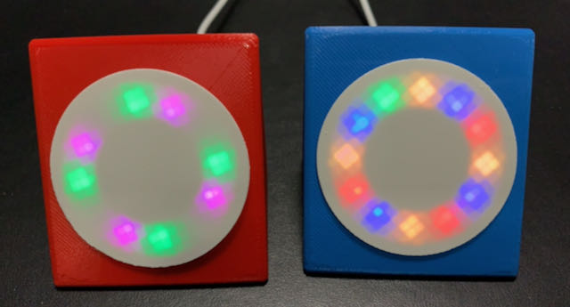

Since we are nowadays working from home, it makes not really sense anymore to have a ‘Build Status Light’ with a ‘Broken Build Siren’ at the office. I wanted to do something fun and created a personal ‘Build Light’ for my team members.  The device is build using some cheap components and is very easy to create. The device is subscribed to MQTT topics which provides the status of multiple CI/CD Pipelines or a single CI/CD pipeline on all leds at once.

I replaced the WiFiManager library with IotWebConf library which has an always available configuration page.

Below the README.MD from the Github Repository which is always up-to-date.

\[git-github-markdown url="https://github.com/arvdsar/MQTT\_NeoPixel\_Status\_Multiple\_Improved/blob/master/README.md" cache\_ttl="3600" cache\_strategy="static"\]
