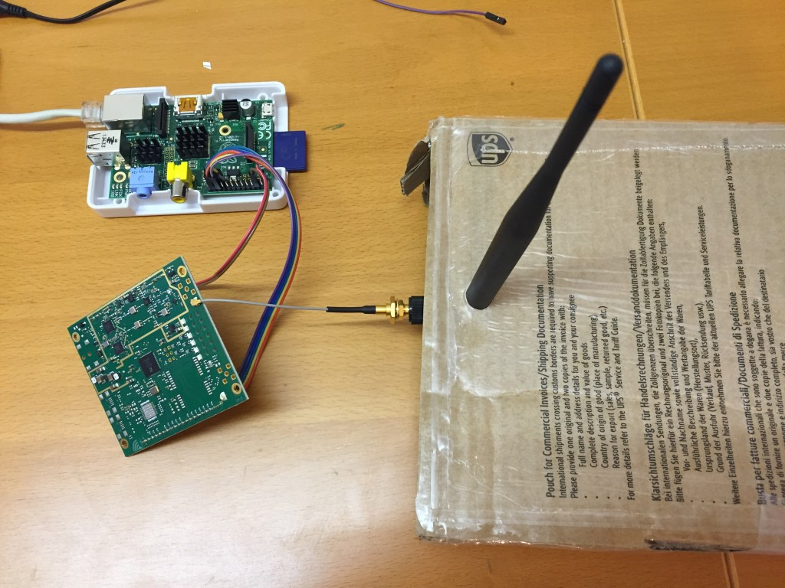
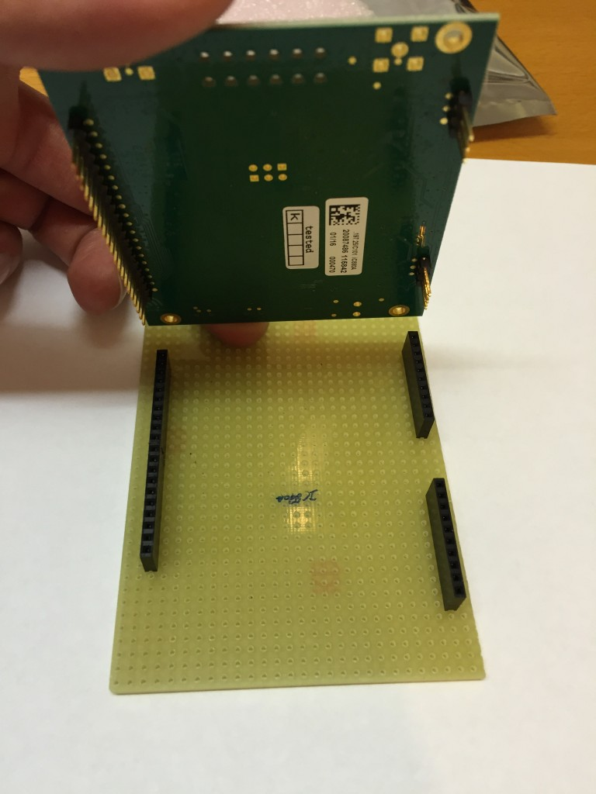
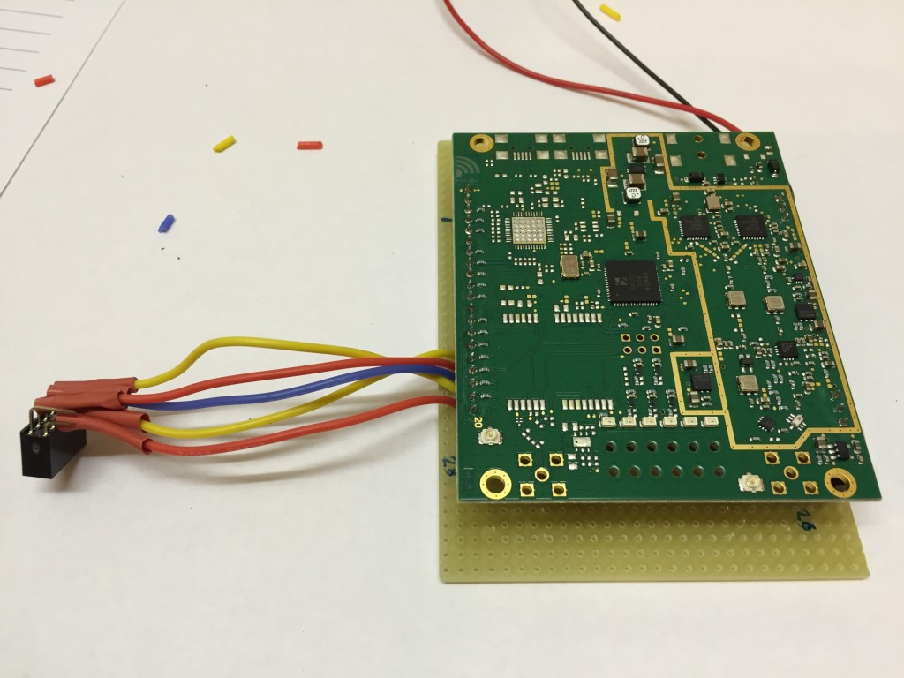
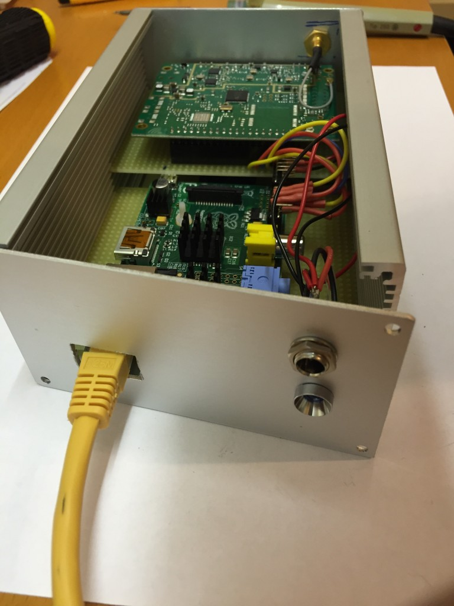
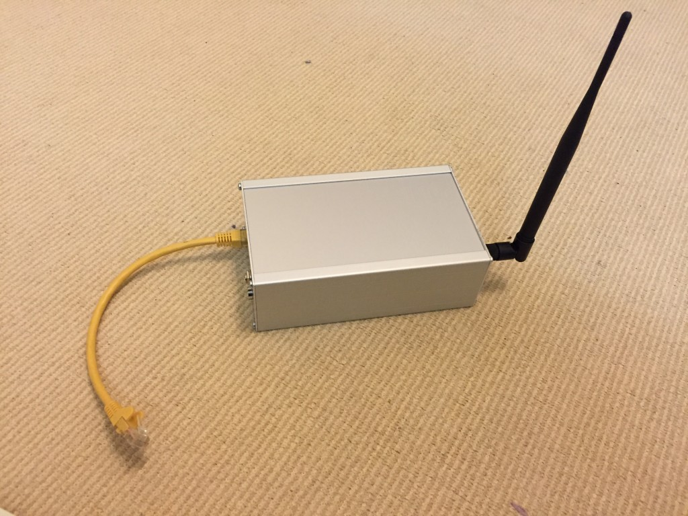

[]

This post will describe how to build your own LoRaWAN gateway to connect to i.e. The Things Network or other IOT Networks. If you haven't heard about the LORA technology and [TheThin](http://thethingsnetwork.org)[gsNetwork](http://thethingsnetwork.org) and you are interested in Internet of Things, do some googling ;-)

You've probably found this article because you are looking for a Do It Yourself guide. I have build my own gateway based on the manuals in the community but I've also put the components in a nice case, something which is usually not described. It's not to hard to build a gateway yourself, it just cost a bunch of money because the necessary gateway board is quite expensive.

What you need:

- Raspberry Pi (model B, B+ or 2)
- IMST IC880A SPI board
- Decent 5V powersupply 3000 mA
- Some wires
- Antenna + Pigtail cable

For the housing you need:

- Universal Case 168 x 103 x 53 (or so) [like this one](https://www.conrad.nl/nl/proma-131030-universele-behuizing-168-x-103-x-56-aluminium-naturel-geeloxeerd-1-stuks-523232.html)
- [Europrint](https://www.conrad.nl/nl/conrad-su527777-printplaat-epoxide-l-x-b-160-mm-x-100-mm-35-m-rastermaat-254-mm-1-stuks-530791.html) 160x100 mm
- 4 x 10 pin female [headerpins](https://www.conrad.nl/nl/wuerth-elektronik-wr-phd-254-mm-female-connector-1-rij-aantal-polen-10-inhoud-1-stuks-1088188.html)
- DC Jackplug 5.5mm 2.1

**Software and Electronics:**

Update 2 oct 2021: I upgraded my TTN Gateway to use the TTN V3 Stack. To do this I had to replace my original Raspberry Pi (1) with a new Raspberry Pi 3B+. By doing this I was able to use the following approach to install the [basic station software using Balena.io](https://www.balena.io/blog/deploy-a-basics-station-lora-gateway-with-ttn-and-balena/). Be aware that the RPI 1 GPIO header is smaller than the GPIO header of the RPI 3. And the trick to get it online is to first do all the Balena stuff, and then define the gateway in the TTN Console.

I just followed the [software install guide](https://github.com/ttn-zh/ic880a-gateway/tree/spi) (I installed Raspbian Jessie Minimal install). I did wonder where my unique Gateway ID was coming from. I still don't know for sure but it seems a unique ID and I guess it is randomly generated at install. So write down your Gateway ID in case of a reinstall.

Next I have some tricks that are not described in the install manuals. First of all you want to keep your SD Card to last as long as possible. After install, make an image of your SD Card and save it somewhere safe. Maybe just prepare a spare SDCard in case the day comes that your card is broken. Another trick is to [store the logfiles in a Ramdrive](https://www.finnchristiansen.de/2015/11/11/raspberry-pi-debian-jessie-ramlog-und-fs2ram/) instead on the SDCard. Only downside, in case of a crash you won't have the logs available. Another solution is to write the logs to a SysLog server. You can setup a separate syslog server (but I shouldn't do that if it is only for this Gateway Raspberry Pi) or send it to the SysLog server on i.e. a Synology NAS.

Logs to Syslog server can be done very easy. On the Raspberry enter the following commands:  
_sudo nano /etc/rsyslog.conf_

In the RULES section add:  
_\*.\*@IP\_OF\_SYSLOG\_Server_  (i.e. your Synology)

Next comment out all other parts where logs are written to disk.  
Now reload rsyslog by typing:  
_sudo service rsyslog restart_

You should see the log records appear in the syslog server and none being written to /var/log.

**Put it all together in a case**

Somewhere I found a remark of somebody who said to use a Europrint within a case and just use the Europrint as a mounting base for your other prints. Actually it works quite well and I decided to cut the board in two parts. One part for the Raspberry Pi and one part for the IC880A board. Now I can slide both boards at a different level inside the case so it all fits nicely.

I soldered the female header pins on the Europrint so the IC880A board connects in these headers. The board easily mounts and we can solder the wires to the Europrint without touching the IC880A board.  
The power adapter connects to a DC jack in the front of the case. The DC Jack is connected to the Raspberry Pi on the 5V/GND GPIO pins and to the IC880A board. (For fun I've put a 5mm Led in front of the case just to see it is powered on _(maybe I'll make it an RGB led someday which can provide some status by changing color and controlled by PWM output on the GPIO pins of the Raspberry Pi)_

The Pigtail antenna cable connects to the IC880A board and the antenna connector is mounted in the top of the Case. Because I made a hole in the front for the RJ45 connector on the LAN cable. It just fits but I can't remove it very easy. I have to unscrew the front to remove the cable. I use a RJ45 LAN Connector blok (female/female) to connect my LAN cable to this short yellow LAN cable. It will do for now.

I've mounted the DC jack plug in the front panel. Connected the LED to this jack and powered the ic880a board and the Raspberry Pi from the jack plug (So the ic880a board is not getting it's power from the Raspberry Pi).

The Raspberry Pi is powered throught the GPIO pins instead of the microUSB connector (just because I didn't had a spare USB cable which I could cut to solder on the DC Jack). It will work fine this way though.
