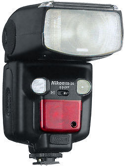
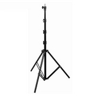

I've been looking around to start with some flash photography. The Nikon SB-900 Flash is the flash I wanted to have after watching Joe McNally's DVD about this device and what you can do with it. Unfortunately it has it's high price and I'm completely unexperience with flash photography so I've been searching for a little more low budget approach.

I managed to get some accessoiries together with which I want to get started on flash photography.

First I got a rather old Philips P32GTC Flash, which has no hotshoe connection, but it does have an external connection that I can use. The flash has 3 settings, 1/4, 1/2 and full power so it didn't take much time to get to know the flash itself. Because this flash has a sync voltage of about 300 volts, I can't connect it directly to my D5000 hotshoe.

I'm using a [Cactus wireless flash trigger v4](http://www.gadgetinfinity.com/product.php?productid=17204&cat=317&page=1) to wirelessly trigger the Philips flash. This accessoiry contains a transmitter to connect to the hotshoe of the camera and a receiver which can be connected by using a hotshoe or using several types of cables to the PC Sync of the flash. One transmitter can trigger an unlimited amount of receivers. The 'Cactus' can handle sync voltages up to 300 volts.

<!--more-->

Today I received a used [Nikon SB-26 flash](http://www.mir.com.my/rb/photography/hardwares/classics/nikonf4/flash/SB26/index.htm). It's a more advanced flash than the Philips so it will probably take me a day to understand it's working. The benefit of this flash is it's build in slave mode. It will fire as soon as it detects another flash firing. It saves me an additional wireless trigger. It seems I can only use it on Auto and Manual Mode but not the TTL mode on modern digital dSLR's.

I'll start experimenting with off camera flash so I need some stands to keep my flashes up in the air. I added a Nikon AS-19 stand to the SB-26 so it can stand on a flat surface. Additionally I bought a [Visico LS-8008 light stand](http://www.visicofoto.com/en/products-1.asp?action=xx&id=701) that can reach a height of nearly 3 meters. On the Visico I mounted a [LumoPro LP634](http://lumopro.com/product.php?id=28) swivel bracket to tilt the flashes up or down in the right angle to the subject. I can mount the SB-26 or the Philips on the swivel bracket and it also offers a mount for an umbrella (actually it seems it is an umbrella mount which can also be used as flash mount ;-).

Batteries are charged now, so let's quit writing and start photographing !
