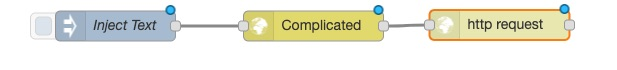

Today I found a new app for the Apple watch which allows you to send information to the watch face or complication as Apple calls it. The app can be downloaded from the app store and is named "Complicated". The site of creator can be found here: [https://mikelyons.org/complicated/](https://mikelyons.org/complicated/)

You can use IFTTT, Zapier or other custom code to connect to the API. There are several areas on the watch face where you can show information.

Node-Red is one of the core applications of my domotica and Internet of Things setup, so I tried to send information from Node-Red to Complicated. Using some standard nodes it was easy to get it going.

I thought this was a nice opportunity to try and write my own Node-Red node specifically for sending data to Complicated.

You can find the source on [Github](https://github.com/arvdsar/node-red-contrib-complicated)  
You can install the node in Node-Red using the Manage-Palette option and search for node-red-contrib-complicated.

Connect a http-request node to the output of the complicated node. No need to configure the http-request node itself.
