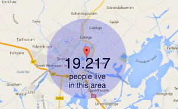

We are at the start of a worldwide roll-out of a global open crowdsourced Internet of Things data network. If you have any interest in IoT or want to be part of the beginning of something big, check out the page that explains all, [The Things Network](http://thethingsnetwork.org/).

In short the guys behind this build a wireless network based on LoRaWAN (Long Range Wireless Area Network) technology which covers Amsterdam. They used about 10 wireless gateways which cost about 1000 euro's each. Now they designed a quite cheap LoRaWAN gateway. You buy it, hook it to your internet connection and you instantly created a LoRaWAN coverage between 3-10 km's. Private people and companies can buy this gateway and together we can build a city, nation or even world wide network specifically for IoT use.

Check out their [Kickstarter campaign](https://www.kickstarter.com/projects/419277966/the-things-network) and buy a gateway to become part of this network.

I bought a gateway myself on Kickstarter. This means the city Sneek in The Netherlands will probably be covered completely by this single gateway! The below picture shows the conservative range of 3 km for my future gateway in Sneek. A colleague bought one too and lives in Bolsward meaning also Bolsward will be covered! Now we want to get coverage everywhere!

